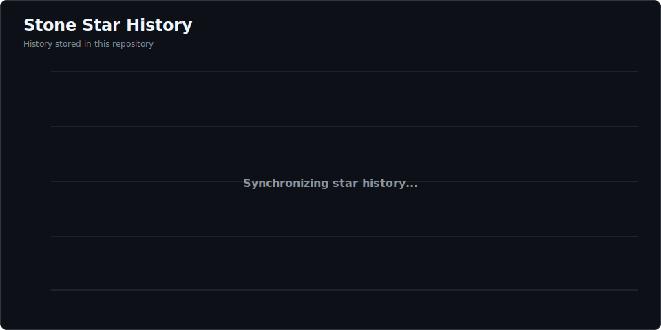

<p align="center">
  
</p>

<h1 align="center">Stone Desktop</h1>

<p align="center">
  <strong>English</strong> | <a href="README.zh-CN.md">简体中文</a>
</p>

<p align="center">
  <a href="https://github.com/EasyCode-Obsidian/Stone/releases/latest"></a>
  <a href="https://github.com/EasyCode-Obsidian/Stone/actions/workflows/release.yml"></a>
  <a href="https://github.com/EasyCode-Obsidian/Stone/releases/latest"></a>
  <a href="LICENSE"></a>
  <a href="https://github.com/EasyCode-Obsidian/Stone/stargazers"></a>
</p>

<p align="center">
  <strong>A personal, local-first AI gateway and coding client control center for Windows, macOS, and Linux.</strong>
</p>

<p align="center">
  <a href="https://github.com/EasyCode-Obsidian/Stone/releases/latest"><strong>Download latest release</strong></a> ·
  <a href="#quick-start">Quick start</a> ·
  <a href="#screenshots">Screenshots</a> ·
  <a href="SECURITY.md">Security</a>
</p>

Stone Desktop brings multi-provider AI access, model routing, protocol conversion, and coding client configuration into one local app. Add your providers, decide which models each account can expose, combine compatible accounts into pools, and connect Claude Code, Codex, or Gemini CLI through one local gateway.

Stone selects an available account according to its model support, quota, health, and pool policy. It can also translate between OpenAI, Anthropic, and Gemini protocols, so a client and its upstream pool do not need to use the same API format.

> Stone is intended for credentials and subscriptions that you own or are authorized to use. It does not provide account sharing, resale, public access, or mechanisms to bypass provider limits.

<p align="center">
  
</p>

<p align="center">
  <a href="docs/media/stone-demo.mp4">Watch the high-quality MP4 demo</a>
</p>

## Why Stone

- **Local control and storage.** No server deployment or remote control service is required; credentials, profiles, account metadata, and history stay on this computer.
- **One place for every account.** Manage official providers, compatible endpoints, API keys, access tokens, and Codex / ChatGPT OAuth sessions from one desktop app.
- **Fewer interruptions.** Account pools can retry, cool down failing accounts, respect quota limits, and fail over to another usable account.
- **Use the model where it is available.** Each account has its own discovered and exposed model list; pools combine the models provided by their members.
- **Connect clients without repeated manual editing.** Stone manages Claude Code, Codex, and Gemini CLI profiles with previews, backups, and restore.
- **Bring your own network route.** Assign HTTP, HTTPS, SOCKS4, or SOCKS5 outbound proxies at account or pool level.

## How It Works

```text
Claude Code / Codex / Gemini CLI
                 |
                 v
        Stone local gateway
       models + pool policy
          /      |      \
     Account A Account B Account C
```

The client connects only to Stone's local address. Stone chooses a suitable account from the selected pool, forwards or converts the request, and returns the response in the protocol expected by the client.

## Features

| Area | What you can do |
| --- | --- |
| Providers and accounts | Add OpenAI, Anthropic, Gemini, compatible or custom endpoints; keep multiple independent accounts under one provider |
| Model control | Discover models per account, expose all or selected models, test an individual model, and choose the models published by each pool |
| Account pools | Use priority, balanced, round-robin, or weighted-random scheduling with concurrency limits, session affinity, retry, cooldown, and failover |
| Quota visibility | View Codex five-hour and weekly quota windows, 24-hour and 14-day trends, and supported provider rate limits |
| Outbound proxies | Configure HTTP, HTTPS, SOCKS4, and SOCKS5 proxies per account or pool; view the configured endpoint, public egress IP, and latency |
| Coding clients | Detect and manage Claude Code, Codex, and Gemini CLI profiles; preview changes and restore backups |
| Protocol gateway | Accept OpenAI Responses, OpenAI Chat Completions, Anthropic Messages, and Gemini generateContent; convert normal and streaming requests, including tool calls and usage |
| Local visibility | Review request status, latency, token usage, account health events, and desktop notifications without storing request or response bodies |
| Application updates | Compare the installed version with GitHub Releases, review notes, and ignore a version; Windows setup and Linux AppImage builds can download and restart into updates, while other packages open Releases for manual replacement |

## Screenshots


| Accounts, quota, and health | Pool scheduling and model policies |
| --- | --- |
|  |  |
| Coding client configuration | Online updates and release notes |
|  |  |

## Quick Start

### 1. Download Stone

Download the package for your platform and `SHA256SUMS` from [GitHub Releases](https://github.com/EasyCode-Obsidian/Stone/releases/latest).

| Platform | Choose |
| --- | --- |
| Windows x64 | `Stone-*-windows-x64-setup.exe` to install, or `Stone-*-windows-x64-portable.exe` to run directly |
| macOS Intel | `Stone-*-macos-x64.dmg` or `Stone-*-macos-x64.zip` |
| macOS Apple Silicon | `Stone-*-macos-arm64.dmg` or `Stone-*-macos-arm64.zip` |
| Linux x64 | `Stone-*-linux-x86_64.AppImage` or `Stone-*-linux-amd64.deb` |
| Linux arm64 | `Stone-*-linux-arm64.AppImage` or `Stone-*-linux-arm64.deb` |

Windows builds are currently unsigned, and macOS builds are not Apple-notarized. Your operating system may show an unknown-publisher or first-launch warning. Verify the file against `SHA256SUMS` before approving it.

If you are upgrading directly from `v0.7.1` or earlier, the first upgrade to `v0.8.0` or later must be installed manually because the older release does not contain the updater. After `v0.8.0` is installed, Windows setup builds and Linux AppImages can download an update in Stone and restart into it. Windows Portable, Linux deb, and current macOS builds open Releases for manual replacement.

On Linux, run an AppImage or install a deb package:

```bash
chmod +x Stone-*.AppImage
./Stone-*.AppImage

sudo apt install ./Stone-*.deb
```

### 2. Add Accounts and Start Routing

> [!NOTE]
> The `v0.8.0` interface currently uses Simplified Chinese. The English menu names below include their current Chinese labels so you can find each page.

1. Open **Providers (供应商)**, confirm or add an upstream, then add an API key or access token. Use **Import ChatGPT account (导入 ChatGPT 账号)** for a Codex / ChatGPT OAuth session.
2. Test the account connection, refresh its available models, and choose the models it may expose.
3. Open **Account Pools (号池)**, add compatible accounts, choose a scheduling policy, and select the models published by the pool.
4. Open **Client Routes (客户端路由)**, select a pool for Claude Code, Codex, or Gemini CLI, then save and enable the route.
5. Open **Client Configuration (客户端配置)**, preview the changes, and apply them. Stone backs up existing files first.
6. Start the local gateway, then launch the coding client.

The default gateway address is `http://127.0.0.1:15721`. Manual connection values and the route token are available on the **Client Routes (客户端路由)** page.

## Privacy and Local Data

- The gateway accepts connections only from this computer.
- Stored provider credentials and proxy passwords are protected by the operating system's secure credential storage.
- Request and response bodies are not written to Stone's request history.
- Stone backs up client configuration files before changing them so they can be restored when needed.
- Account metadata, profiles, quota history, and request statistics remain in the local Stone data directory.

## Important Notes

- Stone is a personal local desktop application, not a team-management, billing, or remote-administration platform.
- A model test sends a real, small request to the upstream. It consumes quota and may incur provider charges.
- Importing a Codex / ChatGPT session does not verify a subscription tier. Available models and backend access are determined by the upstream account.
- Stone does not scan browser cookies or automatically import `~/.codex/auth.json`. A session without a Refresh Token must be imported again after its Access Token expires.
- Codex quota charts are available only for ChatGPT OAuth accounts and begin collecting data after Stone first receives quota information.
- Proxy connectivity tests contact `api.ipify.org` and fall back to `icanhazip.com` to identify the proxy's public egress IP.
- Linux credential storage requires a Secret Service-compatible keyring such as `libsecret` or KWallet. AppImage may also require FUSE 2.
- Stone checks GitHub Releases at startup. You can also check manually, read release notes, or ignore a version under **Settings → Application Updates (设置 → 应用更新)**.
- Windows setup builds and Linux AppImages support in-app download and restart installation. Windows Portable, Linux deb, and current macOS builds require a manual update from Releases.
- Production code signing and macOS notarization are not available yet.

## Community

Use [GitHub Discussions](https://github.com/EasyCode-Obsidian/Stone/discussions) for questions and workflow ideas, [GitHub Issues](https://github.com/EasyCode-Obsidian/Stone/issues) for reproducible bugs and feature requests, and [Private Vulnerability Reporting](https://github.com/EasyCode-Obsidian/Stone/security/advisories/new) for suspected security issues. Read the [Security Policy](SECURITY.md) before sharing diagnostics, and never post real credentials or account data.

Chinese-language discussion is also welcome in QQ group **1061282900**. The community does not support credential sharing, account trading, or advice for bypassing provider terms.

## Star History

<p align="center">
  <a href="https://github.com/EasyCode-Obsidian/Stone/stargazers">
    
  </a>
</p>

## License

Stone Desktop is open source under the [Apache License 2.0](LICENSE). See [NOTICE](NOTICE) and [THIRD_PARTY_NOTICES.md](THIRD_PARTY_NOTICES.md) for attribution and third-party licenses.
