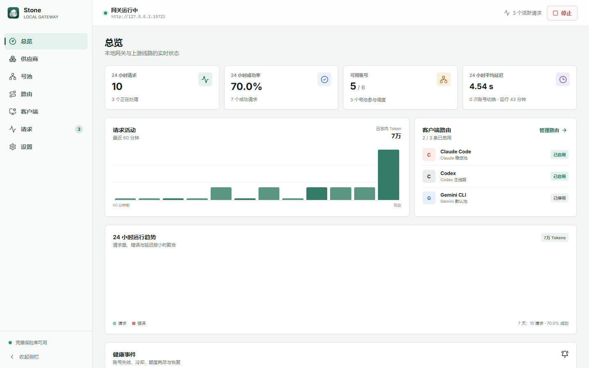
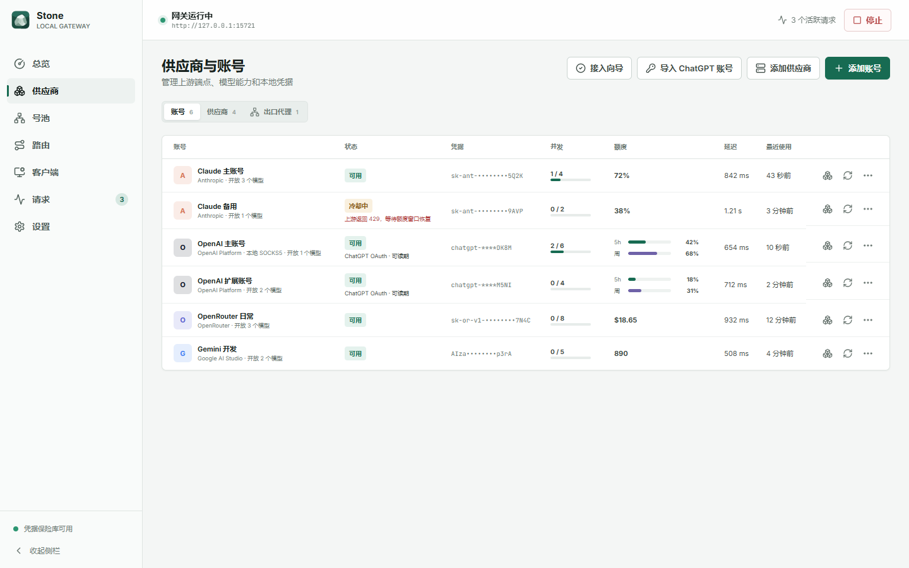
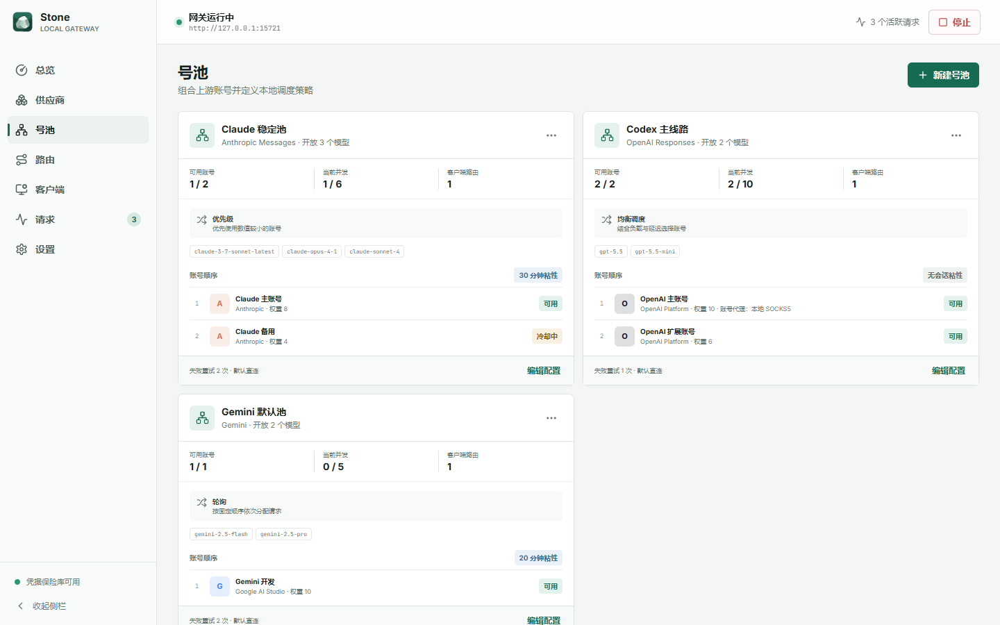
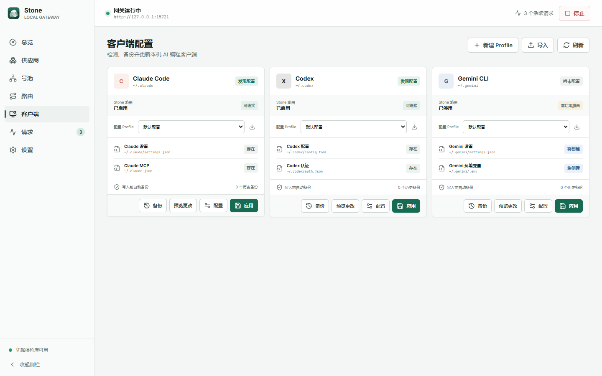
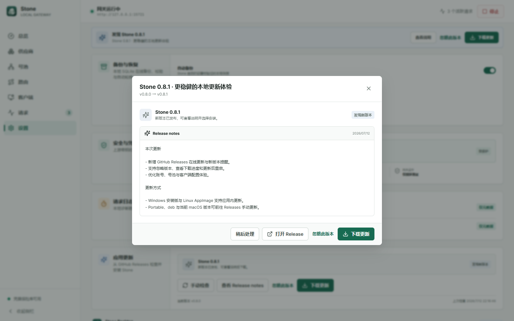

<p align="center">
  
</p>

<h1 align="center">Stone Desktop</h1>

<p align="center">
  <a href="README.md">English</a> | <strong>简体中文</strong>
</p>

<p align="center">
  <a href="https://github.com/EasyCode-Obsidian/Stone/stargazers"></a>
  
  <a href="LICENSE"></a>
</p>

<p align="center">
  <strong>在一个本地桌面应用里，管理你的 AI 账号、号池、代理和编程客户端。</strong>
</p>

Stone Desktop 是一个面向多厂商 AI 账号的本地控制中心。你可以添加不同厂商的账号，决定每个账号开放哪些模型，将账号组成号池，再让 Claude Code、Codex 或 Gemini CLI 通过同一个本地网关使用它们。

Stone 会根据模型支持情况、剩余额度、账号健康状态和号池策略，自动选择当前可用的账号。它还能在 OpenAI、Anthropic 和 Gemini 协议之间转换，因此客户端和上游号池不必使用相同的 API 格式。

## 为什么使用 Stone

- **数据留在本机。** 不需要部署服务器或远程控制服务。
- **统一管理所有账号。** 在一个桌面应用中管理官方厂商、兼容端点、API Key、Access Token 和 Codex / ChatGPT OAuth session。
- **减少使用中断。** 号池可以自动重试、冷却异常账号、遵守额度限制，并切换到其他可用账号。
- **哪个账号有模型，就用哪个账号。** 每个账号拥有独立的模型发现与开放列表，号池汇总成员账号能够提供的模型。
- **不再反复手改客户端配置。** Stone 可以管理 Claude Code、Codex 和 Gemini CLI 的配置 Profile，并提供预览、备份与恢复。
- **按需选择网络出口。** 可在账号或号池级别配置 HTTP、HTTPS、SOCKS4 或 SOCKS5 出口代理。

## 工作方式

```text
Claude Code / Codex / Gemini CLI
                 |
                 v
          Stone 本地网关
         模型策略 + 号池调度
          /      |      \
      账号 A   账号 B   账号 C
```

客户端只连接 Stone 的本机地址。Stone 从目标号池中选择合适账号，转发或转换请求，再使用客户端期望的协议返回结果。

## 主要功能

| 模块 | 可以做什么 |
| --- | --- |
| 厂商与账号 | 添加 OpenAI、Anthropic、Gemini、兼容或自定义端点；在同一厂商下管理多个独立账号 |
| 模型管理 | 按账号拉取模型，开放全部或指定模型，单独测试某个模型，并选择号池对外发布的模型 |
| 号池调度 | 使用优先级、均衡、轮询或加权随机策略，并配置并发限制、会话粘性、重试、冷却与故障切换 |
| 额度查看 | 查看 Codex 5 小时与周额度、24 小时与 14 天趋势，以及厂商支持的 RateLimit 额度 |
| 出口代理 | 为账号或号池配置 HTTP、HTTPS、SOCKS4、SOCKS5 代理，并查看配置端点、公网出口 IP 与延迟 |
| 编程客户端 | 检测和管理 Claude Code、Codex、Gemini CLI 配置 Profile，预览修改并恢复备份 |
| 协议网关 | 接收 OpenAI Responses、OpenAI Chat Completions、Anthropic Messages 与 Gemini generateContent，并转换普通或流式请求，包括工具调用与用量信息 |
| 本地记录 | 查看请求状态、延迟、Token 用量、账号健康事件和桌面通知，不保存请求或响应正文 |
| 应用更新 | 启动后自动比对 GitHub Releases，也可在设置中手动检查；查看更新说明、忽略当前版本、下载进度并更新后重启 |

## 界面预览



| 账号、额度与健康状态 | 号池调度与模型策略 |
| --- | --- |
|  |  |
| 编程客户端配置 | 在线更新与版本说明 |
|  |  |

## 快速开始

### 1. 下载 Stone

从 [GitHub Releases](../../releases) 下载适合当前平台的安装包及 `SHA256SUMS`。

| 平台 | 选择 |
| --- | --- |
| Windows x64 | 使用 `Stone-*-windows-x64-setup.exe` 安装，或直接运行 `Stone-*-windows-x64-portable.exe` |
| macOS Intel | `Stone-*-macos-x64.dmg` 或 `Stone-*-macos-x64.zip` |
| macOS Apple Silicon | `Stone-*-macos-arm64.dmg` 或 `Stone-*-macos-arm64.zip` |
| Linux x64 | `Stone-*-linux-x86_64.AppImage` 或 `Stone-*-linux-amd64.deb` |
| Linux arm64 | `Stone-*-linux-arm64.AppImage` 或 `Stone-*-linux-arm64.deb` |

当前 Windows 版本尚未签名，macOS 版本尚未经过 Apple 公证，系统可能显示“未知发布者”或首次启动警告。批准运行前，请先使用 `SHA256SUMS` 核对文件。

从 `v0.7.1` 升级到 `v0.8.0` 需要手动下载安装一次，因为旧版本尚未包含在线更新组件。安装 `v0.8.0` 后，Windows 安装版与 Linux AppImage 可以在应用内下载后更新并重启；Windows Portable、Linux deb 与当前 macOS 版本会打开 Releases，由用户手动替换。

Linux 可以直接运行 AppImage，或安装 deb：

```bash
chmod +x Stone-*.AppImage
./Stone-*.AppImage

sudo apt install ./Stone-*.deb
```

### 2. 添加账号并开始路由

1. 打开**供应商**，确认或新增一个上游，然后添加 API Key 或 Access Token。Codex / ChatGPT OAuth session 请使用**导入 ChatGPT 账号**。
2. 测试账号连通性，刷新该账号的可用模型，并选择允许开放的模型。
3. 打开**号池**，加入协议兼容的账号，选择调度策略和号池对外发布的模型。
4. 打开**客户端路由**，为 Claude Code、Codex 或 Gemini CLI 选择号池，保存并启用路由。
5. 打开**客户端配置**，预览并应用修改。Stone 会先备份已有文件。
6. 启动本地网关，再启动对应的编程客户端。

网关默认地址为 `http://127.0.0.1:15721`。手工连接参数和路由 Token 可以在“客户端路由”页面查看。

## 隐私与本地数据

- 网关只接受来自当前电脑的连接。
- 已保存的厂商凭据与代理密码由操作系统安全凭据存储保护。
- Stone 的请求历史不会保存请求或响应正文。
- 修改客户端配置前会创建备份，需要时可以恢复。
- 账号元数据、Profile、额度历史和请求统计都保存在 Stone 本地数据目录。

## 使用须知

- Stone 是个人本地桌面应用，不是团队管理、计费或远程管理平台。
- 模型测试会向上游发送一个真实的小请求，消耗额度，并可能产生厂商费用。
- 导入 Codex / ChatGPT session 不会验证订阅等级；可用模型和后端权限以上游账号为准。
- Stone 不会扫描浏览器 Cookie，也不会自动导入 `~/.codex/auth.json`。没有 Refresh Token 的 session 在 Access Token 到期后需要重新导入。
- Codex 额度图仅适用于 ChatGPT OAuth 账号，并从 Stone 首次获取到额度信息后开始积累数据。
- 代理连通性检测会请求 `api.ipify.org`，失败时回退到 `icanhazip.com`，用于识别代理的公网出口 IP。
- Linux 安全凭据存储需要 `libsecret`、KWallet 等兼容 Secret Service 的 Keyring；AppImage 还可能需要 FUSE 2。
- Stone 启动后会自动检查 GitHub Releases，也可以在“设置 → 应用更新”中手动检查、查看更新说明或忽略某个版本。
- Windows 安装版与 Linux AppImage 支持应用内下载并在重启后完成更新；Windows Portable、Linux deb 与当前 macOS 版本需要从 Releases 手动更新。
- 当前尚未提供正式代码签名和 macOS 公证。

## 交流社区

欢迎加入 QQ 群 **1061282900**，交流使用问题、建议和反馈。

## Star 趋势

<p align="center">
  <a href="https://www.star-history.com/#EasyCode-Obsidian/Stone&Date">
    
  </a>
</p>

## 许可证

Stone Desktop 根据 [Apache License 2.0](LICENSE) 开源。版权与第三方许可信息见 [NOTICE](NOTICE) 和 [THIRD_PARTY_NOTICES.md](THIRD_PARTY_NOTICES.md)。
